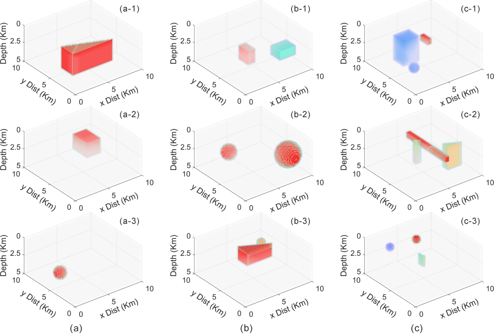

# This is a 3D MT Dataset for Deep Learning

Paper under review: "Three Dimensional Magnetotelluric Forward Modeling Through Deep Learning"

## How to get?

* Trainset Part1 is available at https://www.kaggle.com/datasets/peifanjiang/3dmt-dataset-trainpart1

* Trainset Part2 is available at https://www.kaggle.com/datasets/peifanjiang/3dmt-dataset-trainpart2

* Testset and Validationset are available at https://www.kaggle.com/datasets/peifanjiang/3dmt-dataset-testandval

## How to use?

*See Note*

*Please let me know if you have any questions*
